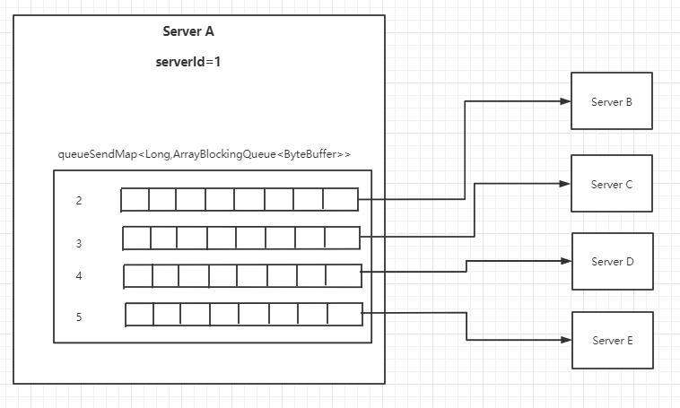

# Zookeeper选举源码分享
## 三类角色
Leader：事务请求的唯一处理者，也可以处理读请求。

Follower：可以直接处理客户端的读请求，并向客户端响应；但其不会处理事务请求，其只会将客户端事务请求转发给Leader来处理；对Leader发起的事务提案具有表决权；同步Leader中的事务处理结果；Leader选举过程的参与者，具有选举权与被选举权。（就好像正式工）

Observer：可以理解为不参与Leader选举的Follower，在Leader选举过程中没有选举权与被选举权；同时，对于Leader的提案没有表决权。用于协助Follower处理更多的客户端读请求。Observer的增加，会提高集群读请求处理的吞吐量，但不会增加事务请求的通过压力，不会增加Leader选举的压力。（就好像临时工）

## 服务的四种状态

LOOKING：选举状态
FOLLOWING：Follower的正常工作状态
OBSERVING：Observer的正常工作状态
LEADING：Leader的正常工作状态

## 三个数据
zxid：其为一个64位长度的Long类型，其中高32位表示epoch，低32位表示xid。

epoch：（时期、年号）每个Leader选举结束后都会生成一个新的epoch，并会通知到集群中所有其它Server，包含Follower与Observer。

xid：事务id，是一个流水号。

## 变量以及方法介绍
```java
public FastLeaderElection(QuorumPeer self, QuorumCnxManager manager) {
        this.stop = false;
        this.manager = manager;
        starter(self, manager);
    }
```
选举类的构造方法需要传入两个类：QuorumPeer，QuorumCnxManager。这两个类分别代表需要选举的服务类以及该服务和其他服务间的连接管理类。
```java
public class QuorumPeer extends ZooKeeperThread implements QuorumStats.Provider {
	//PARTICIPANT, OBSERVER;
    private LearnerType learnerType = LearnerType.PARTICIPANT;
    //Server需要知道我和哪些Server集群
    protected Map<Long, QuorumServer> quorumPeers;
    //Server本身id(serverId)
    private long myid;
    //该Server认为谁是他的Leader,Vode中包含Leader信息
    volatile private Vote currentVote;
    //Server的选举TCP通道
    private InetSocketAddress myQuorumAddr;
   

	//内部类，代表与该Server连接的其他Server
    public static class QuorumServer {
        private QuorumServer(long id, InetSocketAddress addr,
                InetSocketAddress electionAddr) {
            this.id = id;
            this.addr = addr;
            this.electionAddr = electionAddr;
        }

        public QuorumServer(long id, InetSocketAddress addr) {
            this.id = id;
            this.addr = addr;
            this.electionAddr = null;
        }
        
        private QuorumServer(long id, InetSocketAddress addr,
                    InetSocketAddress electionAddr, LearnerType type) {
            this.id = id;
            this.addr = addr;
            this.electionAddr = electionAddr;
            this.type = type;
        }
        
        public QuorumServer(long id, String hostname,
                            Integer port, Integer electionPort,
                            LearnerType type) {
	    this.id = id;
	    this.hostname=hostname;
	    if (port!=null){
                this.port=port;
	    }
	    if (electionPort!=null){
                this.electionPort=electionPort;
	    }
	    if (type!=null){
                this.type = type;
	    }
	    this.recreateSocketAddresses();
	}
	
		//数据传输的TCP链接
        public InetSocketAddress addr;
		//选举的TCP链接
        public InetSocketAddress electionAddr;
        
        public String hostname;

        public int port=2888;

        public int electionPort=-1;

        public long id;
        
        public LearnerType type = LearnerType.PARTICIPANT;
    }
}
```

```java
    /**
     * 连接管理者。FastLeaderElection(选举算法)使用TCP(管理)
     * 两个同辈Server的通信，并且QuorumCnxManager还管理着这些连接。
     */
    QuorumCnxManager manager;
```

```java
public class QuorumCnxManager {
	//维护该server与其他server的连接，key为集群中其他server的serverId,QuorumServer中包含了TCP链接以及对方服务的信息
    final Map<Long, QuorumPeer.QuorumServer> view;
    //维护该server的消息缓冲队列，key为集群中其他server的serverId,value为消息队列
    final ConcurrentHashMap<Long, ArrayBlockingQueue<ByteBuffer>> queueSendMap;
    //该server接收其他server发送过来的消息队列
    public final ArrayBlockingQueue<Message> recvQueue;
}

```
queueSendMap结构



```java
	/*
	*server发送的通知实体类
	*/
    static public class Notification {
    //server推荐的leader(serverId)
        long leader;
    //server的zxid
        long zxid;
    //server当前所处的epoch
        long electionEpoch;
    //server当前的状态
        QuorumPeer.ServerState state;
    //server本身的id(serverId)
        long sid;
    //server所推荐的leader的epoch
        long peerEpoch;
}
```
```java
    //发送通知方法
    private void sendNotifications() {
        // 遍历所有具有选举权的server
        for (QuorumServer server : self.getVotingView().values()) {
            long sid = server.id;

            ToSend notmsg = new ToSend(ToSend.mType.notification,
                    proposedLeader,
                    proposedZxid,
                    logicalclock.get(),
                    QuorumPeer.ServerState.LOOKING,
                    sid,    // 接受者的server id
                    proposedEpoch);
            sendqueue.offer(notmsg);
        }
    }
```
```java
//对比new和cur哪个更适合当主
protected boolean totalOrderPredicate(long newId, long newZxid, long newEpoch, long curId, long curZxid, long curEpoch) {
        return ((newEpoch > curEpoch) ||
                ((newEpoch == curEpoch) &&
                        ((newZxid > curZxid) || ((newZxid == curZxid) && (newId > curId)))));
    }
```
```java

//选举是否已经有结果，即votes是为选票箱，vote为选票
//查找选票箱中和vote推荐的leader一致的选票，加入set集合
//判断set的长度是否大于所有server数量的一半,如果大于，则表示该选票支持的leader有效，可以结束选举
protected boolean termPredicate(HashMap<Long, Vote> votes, Vote vote) {

        HashSet<Long> set = new HashSet<Long>();
        for (Map.Entry<Long, Vote> entry : votes.entrySet()) {
            if (vote.equals(entry.getValue())) {
                set.add(entry.getKey());
            }
        }

        return self.getQuorumVerifier().containsQuorum(set);
    }
    
    
    
    public boolean containsQuorum(Set<Long> set){
        return (set.size() > half);
    }
```
## 选举源码
```java
    public Vote lookForLeader() throws InterruptedException {
        // ----------------------- 1 创建选举对象，做选举前的初始化工作 ---------------------
        if (self.start_fle == 0) {
            self.start_fle = Time.currentElapsedTime();
        }
        try {
            // key为投票者的serverid，value为选票
            // 该集合相当于投票箱,只存放同一轮次的投票
            HashMap<Long, Vote> recvset = new HashMap<Long, Vote>();
            // 其中存放的是投票者的状态不是looking的选票
            HashMap<Long, Vote> outofelection = new HashMap<Long, Vote>();
            // notTimeout，notification Timeout
            int notTimeout = finalizeWait;

            // ----------------------- 2 将自己作为初始leader投出去 ---------------------
            synchronized (this) {
                // 逻辑时钟
                logicalclock.incrementAndGet();
                // 更新当前server的推荐信息为当前server自己
                // getInitId()：获取当前server的id
                // getInitLastLoggedZxid()：获取当前server最后的（也是最大的）zxid
                // getPeerEpoch()：获取当前server的epoch
                updateProposal(getInitId(), getInitLastLoggedZxid(), getPeerEpoch());
            }

            // 将更新过的信息发送出去（将更新过的信息写入到一个发送队列）
            sendNotifications();

            // ----------------------- 3 验证自己与大家的投票谁更适合做leader ---------------------

            while ((self.getPeerState() == ServerState.LOOKING) &&
                    (!stop)) {
                // recvqueue，receive queue，其中存放着接受到的所有外来的通知
                Notification n = recvqueue.poll(notTimeout,
                        TimeUnit.MILLISECONDS);

                if (n == null) {
                    if (manager.haveDelivered()) {
                        // 重新发送，目的是为了重新再接收
                        sendNotifications();
                    } else {
                        // 重新连接zk集群中的每一个server
                        manager.connectAll();
                    }

                } else if (validVoter(n.sid) && validVoter(n.leader)) {
                    switch (n.state) {
                        case LOOKING:
                            //思考1：什么情况下会出现接收到的选票epoch大于自己的
                            if (n.electionEpoch > logicalclock.get()) {
                                // 更新当前server所在的选举的逻辑时钟
                                logicalclock.set(n.electionEpoch);
                                // 清空票箱
                                recvset.clear();
                                // 判断当前server与n谁更适合做leader，无论谁更适合，
                                // 都需要更新当前server的推荐信息，然后广播出去
                                if (totalOrderPredicate(n.leader, n.zxid, n.peerEpoch,
                                        getInitId(), getInitLastLoggedZxid(), getPeerEpoch())) {
                                    updateProposal(n.leader, n.zxid, n.peerEpoch);
                                } else {
                                    updateProposal(getInitId(),
                                            getInitLastLoggedZxid(),
                                            getPeerEpoch());
                                }
                                sendNotifications();
                                // 处理算来n过时的情况：n对于当前选举没有任何用处，直接丢掉
                            } else if (n.electionEpoch < logicalclock.get()) {
                            } else if (totalOrderPredicate(n.leader, n.zxid, n.peerEpoch,
                                    proposedLeader, proposedZxid, proposedEpoch)) {
                                // 处理n.electionEpoch 与 logicalclock.get() 相等的情况
                                // totalOrderPredicate()用于判断外来n与当前server所推荐的leader
                                // 谁更适合做新的leader
                                // 更新当前server的推荐信息
                                updateProposal(n.leader, n.zxid, n.peerEpoch);
                                // 广播出去
                                sendNotifications();
                            }

                            // 将外来n通知封装为一个选票，投放到“选票箱”
                            recvset.put(n.sid, new Vote(n.leader, n.zxid, n.electionEpoch, n.peerEpoch));

                            // ----------------------- 4 判断本轮选举是否可以结束了 ---------------------
                            if (termPredicate(recvset,
                                    new Vote(proposedLeader, proposedZxid,
                                            logicalclock.get(), proposedEpoch))) {

                                //思考2：此处已经形成支持率过半的选票，为什么不直接结束选举，而需要掏空队列呢？
                                while ((n = recvqueue.poll(finalizeWait,
                                        TimeUnit.MILLISECONDS)) != null) {
                                    if (totalOrderPredicate(n.leader, n.zxid, n.peerEpoch,
                                            proposedLeader, proposedZxid, proposedEpoch)) {
                                        recvqueue.put(n);
                                        break;
                                    }
                                }
                                if (n == null) {
                                    self.setPeerState((proposedLeader == self.getId()) ?
                                            ServerState.LEADING : learningState());

                                    Vote endVote = new Vote(proposedLeader,
                                            proposedZxid,
                                            logicalclock.get(),
                                            proposedEpoch);
                                    leaveInstance(endVote);
                                    return endVote;
                                }
                            }
                            break;
                        // ----------------------- 5 处理无需选举的情况 ---------------------
                        case OBSERVING:
                            break;
                        case FOLLOWING:
                        case LEADING:
                            outofelection.put(n.sid, new Vote(n.version,
                                    n.leader,
                                    n.zxid,
                                    n.electionEpoch,
                                    n.peerEpoch,
                                    n.state));

                            //选票都在同一个epoch的逻辑
                            if (n.electionEpoch == logicalclock.get()) {
                                recvset.put(n.sid, new Vote(n.leader,
                                        n.zxid,
                                        n.electionEpoch,
                                        n.peerEpoch));

                                //思考3：checkLeader的作用是什么
                                if (ooePredicate(recvset, outofelection, n)) {
                                    self.setPeerState((n.leader == self.getId()) ?
                                            ServerState.LEADING : learningState());

                                    Vote endVote = new Vote(n.leader,
                                            n.zxid,
                                            n.electionEpoch,
                                            n.peerEpoch);
                                    leaveInstance(endVote);
                                    return endVote;
                                }
                            }


                            if (ooePredicate(outofelection, outofelection, n)) {
                                synchronized (this) {
                                    logicalclock.set(n.electionEpoch);
                                    self.setPeerState((n.leader == self.getId()) ?
                                            ServerState.LEADING : learningState());
                                }
                                Vote endVote = new Vote(n.leader,
                                        n.zxid,
                                        n.electionEpoch,
                                        n.peerEpoch);
                                leaveInstance(endVote);
                                return endVote;
                            }
                            break;
                        default:
                            break;
                    }
                } else {
                    if (!validVoter(n.leader)) {
                    }
                    if (!validVoter(n.sid)) {
                    }
                }
            }
            return null;
        } finally {
            try {
                if (self.jmxLeaderElectionBean != null) {
                    MBeanRegistry.getInstance().unregister(
                            self.jmxLeaderElectionBean);
                }
            } catch (Exception e) {
            }
            manager.getConnectionThreadCount();
        }
    }
```